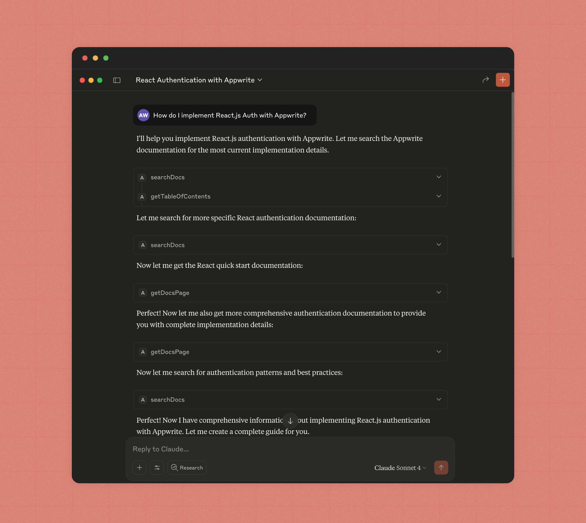
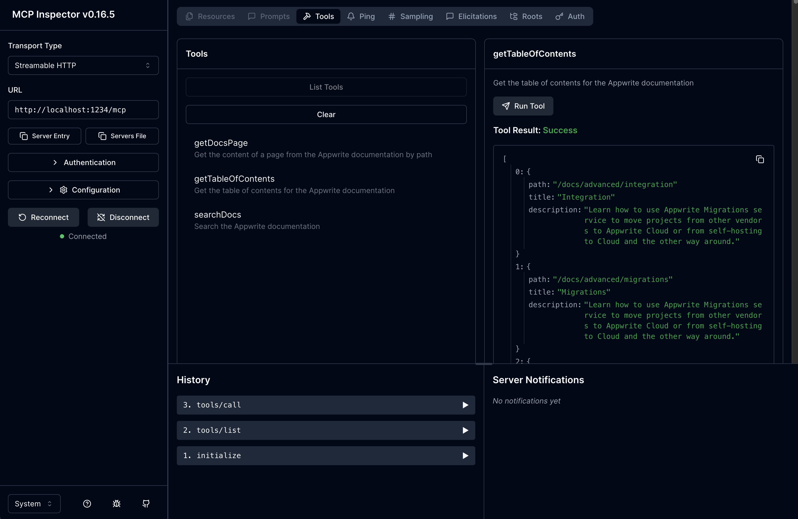

<div align="center">

</div>

# Appwrite Docs MCP Server
This MCP server is a tool that allows IDEs (Cursor, Windsurf, Claude Code, etc.) to utilize the Appwrite documentation.

## Usage in your IDE (Cursor, Windsurf, Claude Code, etc.)

### Cursor

<strong><a href="https://apwr.dev/docs-mcp-cursor">Click here to add the Appwrite Docs MCP Server to Cursor</a></strong>

### VSCode

<strong><a href="https://apwr.dev/docs-mcp-vscode">Click here to add the Appwrite Docs MCP Server to VSCode</a></strong>

### Claude Code

Run the following command to add the MCP server to Claude Code:
```bash
claude mcp add appwrite-docs-mcp https://mcp-for-docs.appwrite.io -t http
```

### Windsurf

Add the following to your global Windsurf MCP configuration file (`~/.codeium/windsurf/mcp_config.json`):

```json
{
  "mcpServers": {
    "appwrite-docs-mcp": {
      "serverUrl": "https://mcp-for-docs.appwrite.io"
    }
  }
}
```

## Development

Before setting up, make sure you have Bun installed.

Then, install the dependencies:
```bash
bun install
```

Check out the [.env.example](.env.example) file for the environment variables you need to set.

### Running Locally (Without Docker)

### Initialization
There are three processes involved in setting up the MCP server, to ensure we have the most up-to-date documentation available.

- **Downloading content:** This script downloads the documentation to `./content` and generates a table of contents JSON file.
- **Initializing vector store:** This script initializes the vector store (using a local LibSQL database) with the documentation and relevant metadata.

Simply run the following command to initialize the MCP server:
```bash
bun run init
```

### Building and running the MCP server
First, build the server:
```bash
bun run build
```

Then, start the MCP server:
```bash
bun run start
```

The server should, by default, be available at `http://localhost:1234`.

## Setting up with Docker
Run the following command to build the Docker image:
```bash
bun run init
docker compose build
docker compose up
```

## Usage

### Inspect via the MCP Inspector
Simply run the following command to inspect the MCP server:
```bash
bun run mcp-inspect
```

A web browser tab will open up with the inspector interface.

<div align="center">

</div>


## Use in your IDE (Cursor, Windsurf, Claude Code, etc.)
Here is a sample configuration file:

```json
// .cursor/mcp.json
{
  "mcpServers": {
    "appwrite-docs-mcp": {
      "url": "http://localhost:1234"
    }
  }
}
```

The same configuration applies to any standard MCP client (Windsurf, Cursor, Claude, Claude Code, etc.).


